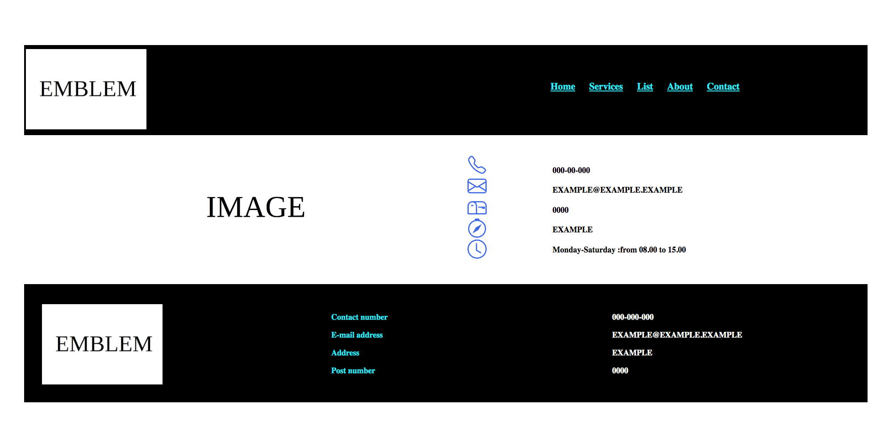

# responsive-web-example
This is an responsive web site example.  

When you add code in a page, you can see images as if in the below.

# Questions?

Feel free for any suggestions, bugs, recommendations or improvements.

# THANKS
