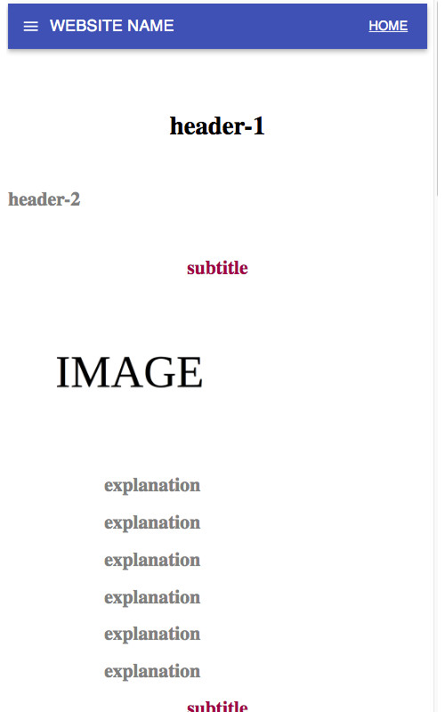

# responsive-web-example

This is an responsive web site example.  

# Outputs for big and small size

For this projects needs to be installed some packages which are mentioned at below.

npm install @material-ui/core

npm install @material-ui/icons

npm install --save react-router-dom

npm install react-bootstrap-icons --save

npm install react-responsive --save

# Outputs for big and small size

For big screen :

For small screen :

# Questions?

Feel free for any suggestions, bugs, recommendations or improvements.

# THANKS
